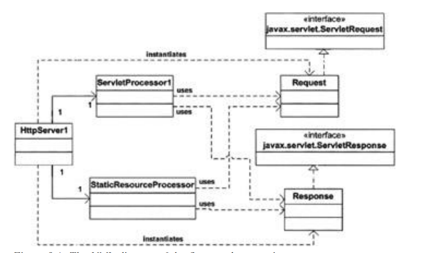

# 待定 #

## 第一章 一个简单的Web服务器 ##
本章介绍了java web servers是如何工作的。Web服务器也叫作HTTP（超文本传输协议）服务器，因为服务器使用HTTP协议与客户端（通常是浏览器）进行通信。Java Web服务器使用两个重要的类java.net.Socket 与java.net.ServerSocket来进行HTTP通信。因此，本章首先讨论HTTP，与这两个重要的类，然后，继续介绍简单的Web服务器。

### 超文本传输协议(HTTP) ###
什么是HTTP？HTTP是服务器与浏览器之间，用来通信的协议。它其实就是一个请求与响应的协议。客户端请求一个资源，服务器对此请求作出响应。HTTP协议的传输依靠的是TCP协议（网络知识，译注），默认使用的TCP端口是80。第一版的HTTP协议的版本号是HTTP/0.9，后来被HTTP/1.0所替代。当前使用的版本是HTTP/1.1（HTTP/2.0已经到来，译注），具体协议规范请访问
http://www.w3.org/Protocols/HTTP/1.1/rfc2616.pdf。

*注意：本章只是概要性的介绍下HTTP 1.1协议，目的只是帮助读者更好的理解服务器与客户端之间的通信格式。如果你需要更详细的协议规范，请访问上面的网址*

HTTP协议里，都是客户端通过建立一个TCP连接与发起一个HTTP请求来开始通信的。服务器是没法主动与客户端建立连接的，只能响应（这个好理解，只有陌生人主动联系你的，哪有你主动联系某个陌生人的，因为你压根不知道要联系哪个？译注）。服务器与客户端都是能终止一条已经建立的连接的（其实就是打电话时，谁都可以挂电话。译注）。例如，网站打开太慢，你等得不耐烦，点了“停止加载”按钮，这就中断了与服务器的连接。

### HTTP请求 ###
一个HTTP请求有3部分组成：
- 方法(Method)——统一资源标识符(URI)——协议/版本
- 请求头部(Request headers)
- 实体(Entity body)

下面是一个HTTP请求例子：
>POST /examples/default.jsp HTTP/1.1
>Accept: text/plain; text/html
>Accept-Language: en-gb
>Connection: Keep-Alive 
>Host: localhost 
>User-Agent: Mozilla/4.0 (compatible; MSIE 4.01; Windows 98) 
>Content-Length: 33 
>Content-Type: application/x-www-form-urlencoded Accept-Encoding: gzip, deflate 
>
>lastName=Franks&firstName=Michael

第一行声明了“方法 ——统一资源标识符 ——协议/版本”。
>POST /examples/default.jsp HTTP/1.1

POST是请求方法。“/examples/default.jsp”是统一资源标识符，“HTTP/1.1”是采用的协议与版本。
每个HTTP请求只能使用一个HTTP规范里定义好的方法。HTTP 1.1支持的请求方法有GET, POST, HEAD, OPTIONS, PUT, DELETE,TRACE。GET与POST是使用得最普遍的方法。
统一资源标识符（URI），指出了所请求的资源的位置（并非一定得是真正的物理位置，任何虚拟的都可以。译注）。URI里的位置是相对服务器的根目录而言的。因此，URI总是以“/”开头。统一资源定位符（URL），实际上只是URI的一种（Web中分得没那么清，可以认为二者一样。译注），具体请参考http://www.ietf.org/rfc/rfc2396.txt。
请求的头部，包含了许多客户端有用的信息和请求的实体。例如，它包含了浏览器的设置语言，请求实体的长度，等等。请求的头之间，使用回车换行（CRLF）分割开（其实就是行尾敲个Enter，译注）。（回车换行，即enter，包含两个动作“移到行首，移到下一行”，windows里用/r/n,Unix 使用/n。计算机技术知识。译注）
请求的头部，与请求的实体之间，通过一空行进行分割。在请求格式里面，这一空行是非常重要的，因为，它告诉服务器，请求的实体从这一空行之后开始。在许多Web开发书籍中，这一空行被当作HTTP请求的第四部分。
在之前这个HTTP请求的例子中，实体部分只是简单的：
lastName=Franks&firstName=Michael
当然，这只是一个例子。实际情况中，这个实体部分一般都是相当长的。

### HTTP响应 ###
跟HTTP请求一样，HTTP响应也是由三部分组成：
- 协议(Protocol)——状态码(Status code)——描述(Description)
- 响应头部(Response headers)
- 实体(Entity body)

下面是一个HTTP响应例子：
>HTTP/1.1 200 OK 
>Server: Microsoft-IIS/4.0 
>Date: Mon, 5 Jan 2004 13:13:33 GMT 
>Content-Type: text/html 
>Last-Modified: Mon, 5 Jan 2004 13:13:12 GMT 
>Content-Length: 112 
>
>```html
><html> 
><head> 
><title>HTTP Response Example</title> 
></head> 
><body> Welcome to Brainy Software </body> 
></html>```

响应的第一行类似于请求的第一行。响应的第一行告诉我们，使用的是HTTP/1.1协议，请求成功（200就是成功），一切OK。
响应头部里包含的有用信息跟请求头部里的类似。响应的实体，是HTML内容。响应头部与实体之间，同样是用一空白行隔开。

### Socket类 ###
socket（中文译为套接字，译注）是一条网络连接（非物理，译注）的终端。应用程序通过它才能向网络上读取、写入数据。不同电脑上的两个应用程序，通过收发字节流来进行通信。当一个应用程序向另一个应用程序发送消息时，它必须得知道另一个应用程序的IP地址和socket的端口（就好比，你向一个集团内部办公室打电话时，你不仅要知道他们集团的电话号码，还要知道办公室所在的分机号码。译注）。在java中，java.net.Socket类代表了我们刚才所谈到的socket。
当你要创建一个socket时，你可以使用Socket类的众多构造方法中的一个。其中一个构造方法通过接收一个ip，一个端口号来创建：
```java
public Socket (java.lang.String host, int port)
```
其中，host远程机器的名字或ip地址，port是需要连接到的远程应用的端口号。例如，要连接到yahoo.com（端口80），你只需要如下进行构造
```java
new Socket ("yahoo.com", 80)
```
一旦成功创建了一个Socket的实例，你就可以使用该实例来发送、接收字节流了。为了发送字节流，首先，你必须执行Socket类的`getOutputStream`方法，这样才能获得一个`java.io.OutputStream`对象。为了给远程应用发送文本信息，通常都是从返回的`java.io.OutputStream`对象中，构造一个`java.io.PrintWriter`对象。为了接收其它连接发过来的字节流，你必须执行Socket类的`getInputStream`方法，该方法返回一个`java.io.InputStream`对象。
下面的代码片段创建了一个能跟本机（127.0.0.1）发送HTTP请求、接收HTTP响应的Socket。它创建了一个`StringBuffer`对象来保存响应内容，并在控制台打印出来。
```java
Socket socket = new Socket("127.0.0.1", "8080"); 
OutputStream os = socket.getOutputStream();
boolean autoflush = true; 
PrintWriter out = new PrintWriter( socket.getOutputStream(), autoflush); 
BufferedReader in = new BufferedReader( new InputStreamReader( socket.getInputstream() ));
 
// send an HTTP request to the web server 
out.println("GET /index.jsp HTTP/1.1"); 
out.println("Host: localhost:8080");
out.println("Connection: Close"); 
out.println(); 

// read the response 
boolean loop = true; 
StringBuffer sb = new StringBuffer(8096); 
while (loop) { 
	if ( in.ready() ) { 
		int i=0;
		while (i!=-1) {
			i = in.read(); 
			sb.append((char) i);
		}
		loop = false;
	}
	Thread.currentThread().sleep(50);
}

// display the response to the out console 
System.out.println(sb.toString()); 
socket.close();
```
请注意，你必须以HTTP协议的格式发送一个HTTP请求，才能从Web服务器处得到一个正确的响应。如果你读了之前的小节，你应该能够理解上面代码中关于HTTP 请求的部分。

### ServerSocket类 ###
上一小节的Socket类代表了一个客户端socket，例如，你无论什么时候想连接到远程服务时，你都会构造一个Socket。那么，如果你想实现的不是一个客户端程序，而是一个服务端程序，例如HTTP服务器、FTP服务器之类的。该怎么做呢？你需要一条不同的途径。因为，服务器根本不知道客户端会在什么时候连接进来，因此它需要永不停歇的7X24运行着。为了使你的程序能永不停歇的运行，你需要使用`java.net.ServerSocket`类。该类是服务端Socket的一个实现（socket是不分什么客户端、服务端的，你编写的程序，如果是提供服务的，那就是服务端。java里分Socket，Server Socket只是方便开发者而已，译注）。
Server Socket跟Socket是不相同的。Server Socket担任的角色是等候者，等候来自客户端发起的连接请求。一旦有连接请求到来，Server Socket就会创建一个Socket实例来跟客户端进行通信。
为了创建一个Server Socket，你需要使用`ServerSocket`类的四个构造方法中的任意一个。你必须指定Server Socket需要监听的IP与端口。通常而言，都是监听在本机，即127.0.0.1。Server Socket监听的IP，称作“绑定IP”。Server Socket的另一个重要属性是它的“积压量”，即它能容纳的最大连接数（其实，就是网络术语中吞吐量的吞，译注）。
下面是一个具体的`ServerSocket`构造方法：
```java
public ServerSocket(int port, int backLog, InetAddress bindingAddress);
```
请注意，在该构造方法中，bindingAddress必须是`java.net.InetAddress`的一个实例。创建InetAddress对象的一种简单方法是，调用它的`getByName`静态方法，传入一个包含地址的字符串。如下所示：
```java
InetAddress.getByName("127.0.0.1");
```
下面的代码创建了一个监听在本机8080端口的ServerSocket，它的最大连接量设为了1。
```java
new ServerSocket(8080, 1, InetAddress.getByName("127.0.0.1"));
```
一旦创建了一个`ServerSocket`实例，你就可以调用它的接收方法，让它一直处于等待状态，直到有它所监听地址端口的连接请求到达。接收方法，只会在有连接请求到达时，才会返回，且返回的是一个Socket实例。接下来，该Socket实例就可以用来跟客户端程序发送、接收字节流了，正如前一小节所介绍的那样。

### 应用程序 ###
本章的web服务器程序，在ex01.pyrmont包中，由三个类组成：
- HttpServer
- Request
- Response

程序的入口点（main方法）在HttpServer类中。该main方法创建了一个HttpServer的实例，然后，调用它的等待方法。该方法的意义，如它的名字一样，“等待”。等待客户端的连接到达，处理连接，然后发送响应给客户端。它会一直等待，直到它接收到“关闭”命令。
本章的应用程序只能发送文件系统上的静态资源，例如HTML文件，图片。同时，它也会把到达的连接信息在控制台打印出来。然而，它还不会给客户端发送任何响应头部，例如时间、缓存等。
接下来的小节中，让我们来详细看一下这三个类。

### HttpServer类 ###
HttpServer类代表了一个Web服务器程序，它的代码如“例1.1”所示。注意，为了节省空间，“等待”方法的代码在“例1.2”中给出，此处不再给出。

例1.1	HttpServer类
```java
 package ex01.pyrmont;
 import java.net.Socket;
 import java.net.ServerSocket;
 import java.net.InetAddress;
 import java.io.InputStream;
 import java.io.OutputStream;
 import java.io.IOException;
 import java.io.File;
 public class HttpServer {

 /** WEB_ROOT is the directory where our HTML and other files reside. 
 * For this package, WEB_ROOT is the "webroot" directory under the 
 * working directory. 
 * The working directory is the location in the file system 
 * from where the java command was invoked. */ 
 
	public static final String WEB_ROOT = System.getProperty("user.dir") + File.separator + "webroot";
 	// shutdown command 
	private static final String SHUTDOWN_COMMAND = "/SHUTDOWN";
 	// the shutdown command received 
	private boolean shutdown = false;
    public static void main(String[] args) { 
		HttpServer server = new HttpServer();
		server.await();
	}

	public void await() { 
		...
	}
```

例1.2	HttpServer类的await方法
```java
	public void await() {
		ServerSocket serverSocket = null;
		int port = 8080;
		try {
			serverSocket = new ServerSocket(port, 1,
					InetAddress.getByName("127.0.0.1"));
		} catch (IOException e) {
			e.printStackTrace();
			System.exit(1);
		}
		// Loop waiting for a request
		while (!shutdown) {
			Socket socket = null;
			InputStream input = null;
			OutputStream output = null;
			try {
				socket = serverSocket.accept();
				input = socket.getInputStream();
				output = socket.getOutputStream();
				// create Request object and parse
				Request request = new Request(input);
				request.parse();
				// create Response object
				Response response = new Response(output);
				response.setRequest(request);
				response.sendStaticResource();
				// Close the socket
				socket.close();
				// check if the previous URI is a shutdown command
				shutdown = request.getUri().equals(SHUTDOWN_COMMAND);
			} catch (Exception e) {
				e.printStackTrace();
				continue;
			}
		}
	}	
```
该Web服务器程序能提供服务器上的静态资源，这些资源位于WEB_ROOT变量所声明的文件夹（及其子文件夹）中。WEB_ROOT变量的内容初始化如下：
```java
public static final String WEB_ROOT =System.getProperty("user.dir") + File.separator + "webroot";
```
上面的代码中，有一个叫webroot文件夹，该文件夹不仅包含了所有的静态资源，还包含了一些Servlet，你可以用它们来进行测试。
当请求一个静态资源时，你只用在你的浏览器地址栏中输入：
http://machineName:port/staticResource
上面地址中，machineName就是你向服务器发出请求时，服务器的名称或地址。如果你的服务器程序运行在本机，那machinename就可以使用localhost代替。staticResource是WEB_ROOT下的静态资源。
例如，如果你的HttpServer运行在本机，你通过浏览器向它请求index.html资源时，可以在浏览器中输入如下地址：
http://localhost:8080/index.html
要停止该Web服务器程序是，你只用通过浏览器发送一条包含关闭命令字符串的URL即可。关闭命令字符串预先定义在了`HttpServer`类的`SHUTDOWN`静态变量中：
```java
private static final String SHUTDOWN_COMMAND = "/SHUTDOWN";
```
所以，当你要关闭服务器程序时，只用输入如下URL：
http://localhost:8080/SHUTDOWN 
接下来，让我们来探讨一下“列1.2”中的await方法。
为什么命名为await，而不是wait？因为wait是`java.lang.Object`类的方法啦。
`await`方法，首先创建了一个`ServerSocket`实例，接着就进入while循环。
>```java
>serverSocket = new ServerSocket(port, 1,InetAddress.getByName("127.0.0.1"));
...
// Loop waiting for a request
while (!shutdown) {
...
}
>```

while循环内的代码将会一直阻塞在`ServerSocket`实例的`accept`方法上，直到有HTTP请求到达8080端口。
```java
socket = serverSocket.accept();
```
只要接收到HTTP请求，`await`将继续往下执行，从返回的`socket`对象处，获得`java.io.InputStream`与`java.io.OutputStream`，如下所示：
```java
input = socket.getInputStream();
output = socket.getOutputStream();
```
紧接着，`await`将创建一个`ex01.pyrmont.Request`类的实例，并调用它的`parse`方法来解析收到的HTTP请求，从复杂的HTTP协议格式中，提取出信息。
```java 
// create Request object and parse
Request request = new Request(input);
request.parse ();
```
然后，`await`方法将创建一个`ex01.pyrmont.Response`对象，并把之前创建的Request对象传给它，并调用它的`sendStaticResource`方法来发送资源。
最后，`await`方法调用Socket的close方法来关闭该Socket，即关闭连接。接下来，`await`方法对刚才HTTP请求的URI进行判断，判断URI字符串是否就是预先定义好的关闭命令字符串，如果是的话，就会跳出while，进而结束整个程序。如果不是的话，继续循环，直到有下一条HTTP请求到来。

### Request类 ###
类`ex01.pyrmont.Request`代表了HTTP请求。创建该类的实例时，需要在构造方法中传入一个`InputStream`对象，该对象是由负责跟客户端通信的Socket返回的。我们可以通过`InputStream`对象的任一跟“读”相关的方法中，得到HTTP请求的原始格式数据。
Request类的代码如“例1.3”所示，它的两个方法，`parse`与`getUri`分别在“例1.4”与“例1.5”中给出。

例1.3	Request类
```java
package ex01.pyrmont;
import java.io.InputStream;
import java.io.IOException;
public class Request {
private InputStream input;
private String uri;
public Request(InputStream input) {
this.input = input;
}
public void parse() {
...
}
private String parseUri(String requestString) { 
...
}
public String getUri() {
return uri;
}
}
```

例1.4 parse方法
```java
public void parse() {
// Read a set of characters from the socket
StringBuffer request = new StringBuffer(2048);
int i;
byte[] buffer = new byte[2048];
try {
i = input.read(buffer);
}
catch (IOException e) {
e.printStackTrace();
i = -1;
}
for (int j=0; j<i; j++) {
request.append((char) buffer[j]);
}
System.out.print(request.toString());
uri = parseUri(request.toString());
}
```

例1.5 parseUri方法
```java
private String parseUri(String requestString) {
int index1, index2;
index1 = requestString.indexOf(' ');
if (index1 != -1) {
index2 = requestString.indexOf(' ', index1 + 1);
if (index2 > index1)
return requestString.substring(index1 + 1, index2);
}
return null;
}
```
`parse`方法的作用是解析HTTP请求的原始格式数据，它的工作并不是很多。该方法从`InputStream`里读取字节流，并把它还原为HTTP请求格式，存储进`StringBuffer`变量， 然后，通过调用私有方法`parseUri`来进一步解析HTTP请求，得到请求的URI。公共方法`getUri`则是向外界返回URI变量内容。
*注意	更多关于HTTP 原始请求数据的处理过程，将在第三章及以后的章节中展开。*
要理解`parse`与`parseUri`方法是如何工作的，你需要之前章节中关于“超文本传输协议”的知识储备。本章中，我们暂时只讨论HTTP请求的第一行，姑且称为“请求行”吧。还记得它的格式吗？
>方法(Method)——统一资源标识符(URI)——协议/版本

上面的各个元素之间，使用空格分割开来。下面举个具体的例子：
>GET /index.html HTTP/1.1

`parse`方法从`InputStream`（HttpServer传过来的）中读取所有的字节流，并把它们存储在一个字节数组中`buffer`。然后，使用一个叫request的`StringBuffer`来从这些字节中还原出字符，并把最后组成的字符串传递给`parseUri`方法。
`parseUri`方法首先找到第一个空格，与第二个空格的位置，接着截取出这两个位置之间的内容，就是URI。

### Response类 ###
类`ex01.pyrmont.Response`代表了一个HTTP响应。它的代码如“例1.6”所示。

例1.6 Response类
```java
package ex01.pyrmont;

import java.io.OutputStream;
import java.io.IOException;
import java.io.FileInputStream;
import java.io.File;

/*
  HTTP Response = Status-Line
    *(( general-header | response-header | entity-header ) CRLF)
    CRLF
    [ message-body ]
    Status-Line = HTTP-Version SP Status-Code SP Reason-Phrase CRLF
*/

public class Response {

  private static final int BUFFER_SIZE = 1024;
  Request request;
  OutputStream output;

  public Response(OutputStream output) {
    this.output = output;
  }

  public void setRequest(Request request) {
    this.request = request;
  }

  public void sendStaticResource() throws IOException {
    byte[] bytes = new byte[BUFFER_SIZE];
    FileInputStream fis = null;
    try {
      File file = new File(HttpServer.WEB_ROOT, request.getUri());
      if (file.exists()) {
        fis = new FileInputStream(file);
        int ch = fis.read(bytes, 0, BUFFER_SIZE);
        while (ch!=-1) {
          output.write(bytes, 0, ch);
          ch = fis.read(bytes, 0, BUFFER_SIZE);
        }
      }
      else {
        // file not found
        String errorMessage = "HTTP/1.1 404 File Not Found\r\n" +
          "Content-Type: text/html\r\n" +
          "Content-Length: 23\r\n" +
          "\r\n" +
          "<h1>File Not Found</h1>";
        output.write(errorMessage.getBytes());
      }
    }
    catch (Exception e) {
      // thrown if cannot instantiate a File object
      System.out.println(e.toString() );
    }
    finally {
      if (fis!=null)
        fis.close();
    }
  }
}

```
首先注意一点，Response类的构造方法，接受的是一个`java.io.OutputStream`对象，如下所示。
```java
public Response(OutputStream output) {
this.output = output;
}
```
Response对象是HttpServer里的await方法创建的。await方法从socket处获得了OutputStream对象，并以此构造了Response。
Response类有两个公共方法：`setRequest`与`sendStaticResource`。其中，`setRequest`方法用来为Response设置Request对象的引用。
`sendStaticResource`则是用来发送类似HTML文件等静态资源的。该方法首先通过传入一个父路径与子路径给File类的构造方法，以此来实例化一个`java.io.File`对象。
```java
File file = new File(HttpServer.WEB_ROOT, request.getUri());
```
然后，会检查该file对象是否存在，如果存在的话，就会进一步通过该file对象来构造一个`java.io.FileInputStream`对象，然后，通过FileInputStream对象的read方法，读出指定长度的字节，并把这些字节写入OutputStream对象。注意，在本例中，静态资源的内容是被原模原样地发送给浏览器的。
```java
if (file.exists()) {
        fis = new FileInputStream(file);
        int ch = fis.read(bytes, 0, BUFFER_SIZE);
        while (ch!=-1) {
          output.write(bytes, 0, ch);
          ch = fis.read(bytes, 0, BUFFER_SIZE);
        }
      }
```

如果指定文件不存在，`sendStaticResource`方法将会给浏览器发送一条“资源不存在”的错误信息。
```java
 // file not found
        String errorMessage = "HTTP/1.1 404 File Not Found\r\n" +
          "Content-Type: text/html\r\n" +
          "Content-Length: 23\r\n" +
          "\r\n" +
          "<h1>File Not Found</h1>";
        output.write(errorMessage.getBytes());
```

### 运行程序 ###
在你的工作目录，编译你的java类，然后在命令行中输入：
`java ex01.pyrmont.HttpServer`
就可以启动服务器程序了。
你可以在你的浏览器地址栏中输入
>http://localhost:8080/index.html 

来测试一下你的程序。
一切正常的话，你将在浏览器中看到如下界面，图1.1。

图1.1


同时，你会在控制台看到如下类似的信息：
>GET /index.html HTTP/1.1
Host: localhost:8080
Connection: keep-alive
Accept: text/html,application/xhtml+xml,application/xml;q=0.9,image/webp,*/*;q=0.8
Upgrade-Insecure-Requests: 1
User-Agent: Mozilla/5.0 (Windows NT 6.1; WOW64) AppleWebKit/537.36 (KHTML, like Gecko) Chrome/48.0.2564.109 Safari/537.36
Accept-Encoding: gzip, deflate, sdch
Accept-Language: zh-CN,zh;q=0.8,en-US;q=0.6,en;q=0.4

>GET /images/logo.gif HTTP/1.1
Host: localhost:8080
Connection: keep-alive
Accept: image/webp,image/*,*/*;q=0.8
User-Agent: Mozilla/5.0 (Windows NT 6.1; WOW64) AppleWebKit/537.36 (KHTML, like Gecko) Chrome/48.0.2564.109 Safari/537.36
Referer: http://localhost:8080/index.html
Accept-Encoding: gzip, deflate, sdch
Accept-Language: zh-CN,zh;q=0.8,en-US;q=0.6,en;q=0.4

### 本章小结 ###
在本章中，我们知道了一个简单的Web服务器程序是如何工作的。本章的服务器程序只有三个类，功能还并不完善，但是，却是一个很好的学习样例。在下一章中，我们将讨论如何处理动态内容。

## 第二章 一个简单的Servlet容器 ##
### 概要 ###
本章通过两个程序来介绍如何开发Servlet容器。第一个程序设计得很简单，方便大家理解Servlet容器是如何工作的。第二个程序只是稍微复杂了一点点。
*注意 每章的Servlet容器程序都会比它的前一章复杂一点点，直到第17章，我们最终开发出一个完整的Servlet容器为止。*
Servlet容器不仅能处理静态资源，而且能处理Servlet。你可以使用`PrimitiveServlet`来测试我们所开发的Servlet容器。`PrimitiveServlet`的代码如“例2.1”所示，你可以在webroot目录下找到它的class文件。更复杂的Servlet已经超越了本章的范围，不过没关系，你可以在接下来的章节中学习它们。

例2.1 PrimitiveServlet.java
```java
import javax.servlet.*;
import java.io.IOException;
import java.io.PrintWriter;

public class PrimitiveServlet implements Servlet {

  public void init(ServletConfig config) throws ServletException {
    System.out.println("init");
  }

  public void service(ServletRequest request, ServletResponse response)
    throws ServletException, IOException {
    System.out.println("from service");
    PrintWriter out = response.getWriter();
    out.println("Hello. Roses are red.");
    out.print("Violets are blue.");
  }

  public void destroy() {
    System.out.println("destroy");
  }

  public String getServletInfo() {
    return null;
  }
  public ServletConfig getServletConfig() {
    return null;
  }

}
```

我们所要探讨的两个容器程序都在`ex02.pyrmont`包里。要理解这两个容器程序是如何工作的，你需要首先对`javax.servlet.Servlet`接口很熟悉。所以，本章第一节，我们先来讨论一下这个接口，然后，再学习，当HTTP请求的是一个Servlet时，Servlet容器应该如何处理。

### javax.servlet.Servlet 接口 ###
`javax.servlet`与`javax.servlet.http`包里的类和接口，是Servlet编程得以实现的关键所在。在这些类和接口中，`javax.servlet.Servlet`接口是最重要的。所有Servlet必须实现该接口，或者继承实现了该接口的类。
Servlet接口的5个方法签名如下：
>public void init(ServletConfig config) throws ServletException ;
>public void service(ServletRequest request, ServletResponse response) throws ServletException, java.io.IOException ;
>public void destroy() public ServletConfig getServletConfig() ;
>public java.lang.String getServletInfo();

上面的5个方法中，`init`，`service`，`destroy`是Servlet的生命周期方法。`init`方法会在servlet类实例化后，被Servlet容器所调用。Servlet容器只会调用`init`方法一次，表明servlet类正在被启动。只有`init`执行成功后，servlet才能接收处理请求。servlet类的编写者，可以重写该方法。他们可以把只需要运行一次的初始化代码（例如，加载驱动类、变量赋值等）放到该方法里。如果不需要什么初始代码的话，不动该方法即可。
当HTTP请求资源是servlet时，Servlet容器会调用该servlet类的`service`方法，来提供服务。Servlet容器传给`service`方法一个`javax.servlet.ServletRequest`对象与`javax.servlet.ServletResponse`对象。`ServletRequest`对象包含有客户端的HTTP请求信息。`ServletResponse`对象用了封装servlet的响应。在servlet的生命周期中，`service`方法可以被调用无数次。（只要有针对该servlet的请求，就会被调用。译注）
当Servlet容器要移除一个servlet服务时，会首先调用该servlet的`destroy`方法。这种情况，通常发生在关闭Servlet 容器程序时，或者Servlet容器需要更多的内存空间时。Servlet容器会等到所有运行该servlet的`service`方法的线程退出或超时后，才会调用servlet的`destroy`方法。Servlet容器调用一个servlet的`destroy`方法后，就意味着该servlet已经被移除了，此后，不再会调用它的`service`方法。`destroy`方法被调用后，该servlet占用的所有资源（例如，内存、文件、线程等）都将被回收，同时，servlet的持久化状态会被更新。
在本章中，你可以使用“例2.1”的`PrimitiveServlet`类来进行测试。`PrimitiveServlet`类实现了`javax.servlet.Servlet`接口，同时实现了Servlet接口的5个方法。`PrimitiveServlet`类的功能很简单，每次`init`，`service`，或者 `destroy`方法被调用时，它都会在控制台打印出方法的名称。同时，`service`还会利用从`ServletResponse`对象处获得的`PrintWriter`向客户端输出信息。

Raphael 2016-2-29 11:20:59 翻译至27页。
## 第二章 一个简单的Servlet容器 ##
### 概要 ###
本章通过两个程序来介绍如何开发Servlet容器。第一个程序设计得很简单，方便大家理解Servlet容器是如何工作的。第二个程序只是稍微复杂了一点点。
*注意 每章的Servlet容器程序都会比它的前一章复杂一点点，直到第17章，我们最终开发出一个完整的Servlet容器为止。*
Servlet容器不仅能处理静态资源，而且能处理Servlet。你可以使用`PrimitiveServlet`来测试我们所开发的Servlet容器。`PrimitiveServlet`的代码如“例2.1”所示，你可以在webroot目录下找到它的class文件。更复杂的Servlet已经超越了本章的范围，不过没关系，你可以在接下来的章节中学习它们。

例2.1 PrimitiveServlet.java
```java
import javax.servlet.*;
import java.io.IOException;
import java.io.PrintWriter;

public class PrimitiveServlet implements Servlet {

  public void init(ServletConfig config) throws ServletException {
    System.out.println("init");
  }

  public void service(ServletRequest request, ServletResponse response)
    throws ServletException, IOException {
    System.out.println("from service");
    PrintWriter out = response.getWriter();
    out.println("Hello. Roses are red.");
    out.print("Violets are blue.");
  }

  public void destroy() {
    System.out.println("destroy");
  }

  public String getServletInfo() {
    return null;
  }
  public ServletConfig getServletConfig() {
    return null;
  }

}
```

我们所要探讨的两个容器程序都在`ex02.pyrmont`包里。要理解这两个容器程序是如何工作的，你需要首先对`javax.servlet.Servlet`接口很熟悉。所以，本章第一节，我们先来讨论一下这个接口，然后，再学习，当HTTP请求的是一个Servlet时，Servlet容器应该如何处理。

### javax.servlet.Servlet 接口 ###
`javax.servlet`与`javax.servlet.http`包里的类和接口，是Servlet编程得以实现的关键所在。在这些类和接口中，`javax.servlet.Servlet`接口是最重要的。所有Servlet必须实现该接口，或者继承实现了该接口的类。
Servlet接口的5个方法签名如下：
>public void init(ServletConfig config) throws ServletException ;
>public void service(ServletRequest request, ServletResponse response) throws ServletException, java.io.IOException ;
>public void destroy() public ServletConfig getServletConfig() ;
>public java.lang.String getServletInfo();

上面的5个方法中，`init`，`service`，`destroy`是Servlet的生命周期方法。`init`方法会在servlet类实例化后，被Servlet容器所调用。Servlet容器只会调用`init`方法一次，表明servlet类正在被启动。只有`init`执行成功后，servlet才能接收处理请求。servlet类的编写者，可以重写该方法。他们可以把只需要运行一次的初始化代码（例如，加载驱动类、变量赋值等）放到该方法里。如果不需要什么初始代码的话，不动该方法即可。
当HTTP请求资源是servlet时，Servlet容器会调用该servlet类的`service`方法，来提供服务。Servlet容器传给`service`方法一个`javax.servlet.ServletRequest`对象与`javax.servlet.ServletResponse`对象。`ServletRequest`对象包含有客户端的HTTP请求信息。`ServletResponse`对象用了封装servlet的响应。在servlet的生命周期中，`service`方法可以被调用无数次。（只要有针对该servlet的请求，就会被调用。译注）
当Servlet容器要移除一个servlet服务时，会首先调用该servlet的`destroy`方法。这种情况，通常发生在关闭Servlet 容器程序时，或者Servlet容器需要更多的内存空间时。Servlet容器会等到所有运行该servlet的`service`方法的线程退出或超时后，才会调用servlet的`destroy`方法。Servlet容器调用一个servlet的`destroy`方法后，就意味着该servlet已经被移除了，此后，不再会调用它的`service`方法。`destroy`方法被调用后，该servlet占用的所有资源（例如，内存、文件、线程等）都将被回收，同时，servlet的持久化状态会被更新。
在本章中，你可以使用“例2.1”的`PrimitiveServlet`类来进行测试。`PrimitiveServlet`类实现了`javax.servlet.Servlet`接口，同时实现了Servlet接口的5个方法。`PrimitiveServlet`类的功能很简单，每次`init`，`service`，或者 `destroy`方法被调用时，它都会在控制台打印出方法的名称。同时，`service`还会利用从`ServletResponse`对象处获得的`PrintWriter`向客户端输出信息。

### 程序1 ###
现在，让我们以Servlet容器的角度来审视下如何进行Servlet编程。简单的讲，一个完整的Servlet容器，能为HTTP请求（请求的是servlet）提供如下功能：
-	当servlet第一次被请求提供服务时，Servlet容器将该servlet的class文件载入jvm，并调用它的`init`方法（只会调用一次）。
-	为每个请求创建一个`javax.servlet.ServletRequest`实例与`javax.servlet.ServletResponse`实例。
-	调用的servlet的`service`方法，并传入`ServletRequest`与`ServletResponse`对象。
-	当servlet被关闭时，调用servlet的`destroy`方法，之后，把servlet类从jvm里卸载掉。

本章第一个Servlet容器程序功能并不完善。因此，它只能运行很简单的servlet，并且不会调用servlet的`init`方法与`destroy`方法。相反，它提供如下功能：
-	等待HTTP请求的到达。
-	创建`ServletRequest`与`ServletResponse`对象。
-	如果请求的是静态资源，则会调用`StaticResourceProcessor`实例的`process`方法，并传入ServletRequest对象与ServletResponse对象。
-	如果请求的是servlet资源，则把servlet的class文件载入进jvm，并调用`service`方法，同时传入ServletRequest对象与ServletResponse对象。

注意，在第一个程序中，每次请求servlet资源时，Servlet容器都会把该servlet载入一次。（这只是雏形，完善的Servlet容器肯定不会这样干，译注）
第一个程序由6个类组成：
-	HttpServer1
-	Request
-	Response
-	StaticResourceProcessor
-	ServletProcessor1
-	Constants

图2.1 展示了第一个程序的UML。

图2.1


第一个程序的入口点是`HttpServer1`类的`main`方法。它创建了一个`HttpServer1`对象，并调用对象的`await`方法。`await`方法一直等待HTTP请求的到来，并为每个HTTP请求创建一个Request对象与Response对象，然后，根据HTTP请求的资源类型（静态还是servlet），将Request对象与Response对象传给`StaticResourceProcessor`实例或`ServletProcessor`实例。
`Constants`类里存放的是会被其它类引用的静态变量`WEB_ROOT`,该变量是final修饰的最终变量。`WEB_ROOT`变量指出了`PrimitiveServlet`类的位置与静态资源的位置。
`HttpServer1`实例将会一直等待请求的到来并处理它们，直到接收到关闭命令为止。关闭命令字符串跟第一章的是相同的。
接下来的几个小节中，我们将逐一探讨这6个类。

### HttpServer1 类 ###
本章中的`HttpServer1`类，与第一章中的`HttpServer`类区别并不是很大。但是，本章中的`HttpServer1`类不仅能处理静态资源，还能处理servlet资源。要访问静态资源，你只用在浏览器中输入如下类似的URL：
>http://machineName:port/staticResource
 
这就是我们在第一章中请求静态资源时的写法，还记得吗？
要访问一个servlet资源时，你需要输入如下格式的地址：
> http://machineName:port/servlet/servletClass 

因此，当你在浏览器中请求本机服务器上的`PrimitiveServlet`时，你需要输入如下URL
> http://localhost:8080/servlet/PrimitiveServlet 

Servlet容器能提供`PrimitiveServlet`，但是，当你请求其它servlet时，例如，`ModernServlet`，则会得到一个错误，因为Servlet容器暂时还不能提供`ModernServlet`，没关系，我们将在另一章中也实现提供`ModernServlet`功能。

`HttpServer1`类的代码如“例2.2”所示

例2.2	HttpServer1类
```java
package ex02.pyrmont;

import java.net.Socket;
import java.net.ServerSocket;
import java.net.InetAddress;
import java.io.InputStream;
import java.io.OutputStream;
import java.io.IOException;

public class HttpServer1 {

  /** WEB_ROOT is the directory where our HTML and other files reside.
   *  For this package, WEB_ROOT is the "webroot" directory under the working
   *  directory.
   *  The working directory is the location in the file system
   *  from where the java command was invoked.
   */
  // shutdown command
  private static final String SHUTDOWN_COMMAND = "/SHUTDOWN";

  // the shutdown command received
  private boolean shutdown = false;

  public static void main(String[] args) {
    HttpServer1 server = new HttpServer1();
    server.await();
  }

  public void await() {
    ServerSocket serverSocket = null;
    int port = 8080;
    try {
      serverSocket =  new ServerSocket(port, 1, InetAddress.getByName("127.0.0.1"));
    }
    catch (IOException e) {
      e.printStackTrace();
      System.exit(1);
    }

    // Loop waiting for a request
    while (!shutdown) {
      Socket socket = null;
      InputStream input = null;
      OutputStream output = null;
      try {
        socket = serverSocket.accept();
        input = socket.getInputStream();
        output = socket.getOutputStream();

        // create Request object and parse
        Request request = new Request(input);
        request.parse();

        // create Response object
        Response response = new Response(output);
        response.setRequest(request);

        // check if this is a request for a servlet or a static resource
        // a request for a servlet begins with "/servlet/"
        if (request.getUri().startsWith("/servlet/")) {
          ServletProcessor1 processor = new ServletProcessor1();
          processor.process(request, response);
        }
        else {
          StaticResourceProcessor processor = new StaticResourceProcessor();
          processor.process(request, response);
        }

        // Close the socket
        socket.close();
        //check if the previous URI is a shutdown command
        shutdown = request.getUri().equals(SHUTDOWN_COMMAND);
      }
      catch (Exception e) {
        e.printStackTrace();
        System.exit(1);
      }
    }
  }
}

```
上诉代码中，`await`方法只有在收到停止命令时，才会结束，否则，一直等待HTTP请求。例2.2中的`await`方法与第一章中的`await`方法有何不同？不同的地方在于，例2.2中的`await`方法，能根据请求资源的不同，而把Request传给`StaticResourceProcessor`对象或`ServletProcessor`对象。如果Request的URI中包含`/servlet/`字符串，则会把该Request传给`ServletProcessor`对象，否则，传给`StaticResourceProcessor`对象。

### Request 类 ###
servlet的`service`方法从Servlet容器处接收两个对象，一个是`javax.servlet.ServletRequest`对象，一个是`javax.servlet.ServletResponse`对象。即所谓的，Servlet容器为每个HTTP请求构造一个`ServletRequest`对象与`ServletResponse`对象，并把它们传给`service`方法。
我们用`ex02.pyrmont.Request`类来代表传给`service`方法的`ServletRequest`对象。`ServletRequest`是一个接口，所以我们需要实现该接口。别担心，在这里我们只是简单的实现接口的部分方法，在之后的章节中，我们才会完整的来实现其它方法。对于有些方法，我们让它保持为空就行，如果需要返回值，就返回一个null，正如，“例2.3”所示的一样。

例2.3	Request类
```java
package ex02.pyrmont;

import java.io.InputStream;
import java.io.IOException;
import java.io.BufferedReader;
import java.io.UnsupportedEncodingException;
import java.util.Enumeration;
import java.util.Locale;
import java.util.Map;
import javax.servlet.RequestDispatcher;
import javax.servlet.ServletInputStream;
import javax.servlet.ServletRequest;


public class Request implements ServletRequest {

  private InputStream input;
  private String uri;

  public Request(InputStream input) {
    this.input = input;
  }

  public String getUri() {
    return uri;
  }

  private String parseUri(String requestString) {
    int index1, index2;
    index1 = requestString.indexOf(' ');
    if (index1 != -1) {
      index2 = requestString.indexOf(' ', index1 + 1);
      if (index2 > index1)
        return requestString.substring(index1 + 1, index2);
    }
    return null;
  }

  public void parse() {
    // Read a set of characters from the socket
    StringBuffer request = new StringBuffer(2048);
    int i;
    byte[] buffer = new byte[2048];
    try {
      i = input.read(buffer);
    }
    catch (IOException e) {
      e.printStackTrace();
      i = -1;
    }
    for (int j=0; j<i; j++) {
      request.append((char) buffer[j]);
    }
    System.out.print(request.toString());
    uri = parseUri(request.toString());
  }

  /* implementation of the ServletRequest*/
  public Object getAttribute(String attribute) {
    return null;
  }

  public Enumeration getAttributeNames() {
    return null;
  }

  public String getRealPath(String path) {
    return null;
  }

  public RequestDispatcher getRequestDispatcher(String path) {
    return null;
  }

  public boolean isSecure() {
    return false;
  }

  public String getCharacterEncoding() {
    return null;
  }

  public int getContentLength() {
    return 0;
  }

  public String getContentType() {
    return null;
  }

  public ServletInputStream getInputStream() throws IOException {
    return null;
  }

  public Locale getLocale() {
    return null;
  }

  public Enumeration getLocales() {
    return null;
  }

  public String getParameter(String name) {
    return null;
  }

  public Map getParameterMap() {
    return null;
  }

  public Enumeration getParameterNames() {
    return null;
  }

  public String[] getParameterValues(String parameter) {
    return null;
  }

  public String getProtocol() {
    return null;
  }

  public BufferedReader getReader() throws IOException {
    return null;
  }

  public String getRemoteAddr() {
    return null;
  }

  public String getRemoteHost() {
    return null;
  }

  public String getScheme() {
   return null;
  }

  public String getServerName() {
    return null;
  }

  public int getServerPort() {
    return 0;
  }

  public void removeAttribute(String attribute) {
  }

  public void setAttribute(String key, Object value) {
  }

  public void setCharacterEncoding(String encoding)
    throws UnsupportedEncodingException {
  }

}
```
可以看到，在本章的`Request`类里，仍然有第一章中介绍的`parse`与`getUri`方法。

### Response 类###
`ex02.pyrmont.Response`类代表了一个响应。同样的，我们只是部分实现`javax.servlet.ServletResponse`接口。如下，例2.4所示。

例2.4
```java
package ex02.pyrmont;

import java.io.OutputStream;
import java.io.IOException;
import java.io.FileInputStream;
import java.io.FileNotFoundException;
import java.io.File;
import java.io.PrintWriter;
import java.util.Locale;
import javax.servlet.ServletResponse;
import javax.servlet.ServletOutputStream;

public class Response implements ServletResponse {

  private static final int BUFFER_SIZE = 1024;
  Request request;
  OutputStream output;
  PrintWriter writer;

  public Response(OutputStream output) {
    this.output = output;
  }

  public void setRequest(Request request) {
    this.request = request;
  }

  /* This method is used to serve a static page */
  public void sendStaticResource() throws IOException {
    byte[] bytes = new byte[BUFFER_SIZE];
    FileInputStream fis = null;
    try {
      /* request.getUri has been replaced by request.getRequestURI */
      File file = new File(Constants.WEB_ROOT, request.getUri());
      fis = new FileInputStream(file);
      /*
         HTTP Response = Status-Line
           *(( general-header | response-header | entity-header ) CRLF)
           CRLF
           [ message-body ]
         Status-Line = HTTP-Version SP Status-Code SP Reason-Phrase CRLF
      */
      int ch = fis.read(bytes, 0, BUFFER_SIZE);
      while (ch!=-1) {
        output.write(bytes, 0, ch);
        ch = fis.read(bytes, 0, BUFFER_SIZE);
      }
    }
    catch (FileNotFoundException e) {
      String errorMessage = "HTTP/1.1 404 File Not Found\r\n" +
        "Content-Type: text/html\r\n" +
        "Content-Length: 23\r\n" +
        "\r\n" +
        "<h1>File Not Found</h1>";
      output.write(errorMessage.getBytes());
    }
    finally {
      if (fis!=null)
        fis.close();
    }
  }


  /** implementation of ServletResponse  */
  public void flushBuffer() throws IOException {
  }

  public int getBufferSize() {
    return 0;
  }

  public String getCharacterEncoding() {
    return null;
  }

  public Locale getLocale() {
    return null;
  }

  public ServletOutputStream getOutputStream() throws IOException {
    return null;
  }

  public PrintWriter getWriter() throws IOException {
    // autoflush is true, println() will flush,
    // but print() will not.
    writer = new PrintWriter(output, true);
    return writer;
  }

  public boolean isCommitted() {
    return false;
  }

  public void reset() {
  }

  public void resetBuffer() {
  }

  public void setBufferSize(int size) {
  }

  public void setContentLength(int length) {
  }

  public void setContentType(String type) {
  }

  public void setLocale(Locale locale) {
  }
}
```
在`getWriter`方法中，传递给`PrintWriter`构造器的第二个参数是一个布尔类型，它代表是否自动把缓存区的内容发送出去。如果为true的话，每次调用`PrintWriter`的`println`方法时，都会立即把缓存区的内容发送出去（但是，`print`方法不会）。
因此，这个`Response`类就有一个小bug。如果刚好在servlet里`service`方法的最后一行调用了`PrintWriter`的`print`方法，**那`print`方法里的内容就不会被发送到客户端**！没关系，我们在后面的章节里又来修复这个问题。
同样的，本章里的`Response`仍然有第一章中讨论的`sendStaticResource`方法。

### StaticResourceProcessor 类###
`ex02.pyrmont.StaticResourceProcessor`类的作用是，为针对静态资源的HTTP请求提供服务。它只有一个`process`方法。详细代码，如“例2.5”所示。

例2.5	StaticResourceProcessor类
```java
package ex02.pyrmont;

import java.io.IOException;

public class StaticResourceProcessor {

  public void process(Request request, Response response) {
    try {
      response.sendStaticResource();
    }
    catch (IOException e) {
      e.printStackTrace();
    }
  }
}
```
`process`方法接收两个对象，一个`Request`，一个`Response`。在方法的内部，只是简单的调用了`Response`对象的`sendStaticResource`方法。

### ServletProcessor1 类 ###
`ex02.pyrmont.ServletProcessor1`类专门服务于针对servlet资源的请求。代码如“例2.6”所示。

例2.6 ServletProcessor1类
```java
package ex02.pyrmont;

import java.net.URL;
import java.net.URLClassLoader;
import java.net.URLStreamHandler;
import java.io.File;
import java.io.IOException;
import javax.servlet.Servlet;
import javax.servlet.ServletRequest;
import javax.servlet.ServletResponse;

public class ServletProcessor1 {

  public void process(Request request, Response response) {

    String uri = request.getUri();
    String servletName = uri.substring(uri.lastIndexOf("/") + 1);
    URLClassLoader loader = null;

    try {
      // create a URLClassLoader
      URL[] urls = new URL[1];
      URLStreamHandler streamHandler = null;
      File classPath = new File(Constants.WEB_ROOT);
      // the forming of repository is taken from the createClassLoader method in
      // org.apache.catalina.startup.ClassLoaderFactory
      String repository = (new URL("file", null, classPath.getCanonicalPath() + File.separator)).toString() ;
      // the code for forming the URL is taken from the addRepository method in
      // org.apache.catalina.loader.StandardClassLoader class.
      urls[0] = new URL(null, repository, streamHandler);
      loader = new URLClassLoader(urls);
    }
    catch (IOException e) {
      System.out.println(e.toString() );
    }
    Class myClass = null;
    try {
      myClass = loader.loadClass(servletName);
    }
    catch (ClassNotFoundException e) {
      System.out.println(e.toString());
    }

    Servlet servlet = null;

    try {
      servlet = (Servlet) myClass.newInstance();
      servlet.service((ServletRequest) request, (ServletResponse) response);
    }
    catch (Exception e) {
      System.out.println(e.toString());
    }
    catch (Throwable e) {
      System.out.println(e.toString());
    }

  }
}
```
Raphael 2016-3-1 11:03:13 翻译到40页下
### Request 类 ###
servlet的`service`方法从Servlet容器处接收两个对象，一个是`javax.servlet.ServletRequest`对象，一个是`javax.servlet.ServletResponse`对象。即所谓的，Servlet容器为每个HTTP请求构造一个`ServletRequest`对象与`ServletResponse`对象，并把它们传给`service`方法。
我们用`ex02.pyrmont.Request`类来代表传给`service`方法的`ServletRequest`对象。`ServletRequest`是一个接口，所以我们需要实现该接口。别担心，在这里我们只是简单的实现接口的部分方法，在之后的章节中，我们才会完整的来实现其它方法。对于有些方法，我们让它保持为空就行，如果需要返回值，就返回一个null，正如，“例2.3”所示的一样。

例2.3	Request类
```java
package ex02.pyrmont;

import java.io.InputStream;
import java.io.IOException;
import java.io.BufferedReader;
import java.io.UnsupportedEncodingException;
import java.util.Enumeration;
import java.util.Locale;
import java.util.Map;
import javax.servlet.RequestDispatcher;
import javax.servlet.ServletInputStream;
import javax.servlet.ServletRequest;


public class Request implements ServletRequest {

  private InputStream input;
  private String uri;

  public Request(InputStream input) {
    this.input = input;
  }

  public String getUri() {
    return uri;
  }

  private String parseUri(String requestString) {
    int index1, index2;
    index1 = requestString.indexOf(' ');
    if (index1 != -1) {
      index2 = requestString.indexOf(' ', index1 + 1);
      if (index2 > index1)
        return requestString.substring(index1 + 1, index2);
    }
    return null;
  }

  public void parse() {
    // Read a set of characters from the socket
    StringBuffer request = new StringBuffer(2048);
    int i;
    byte[] buffer = new byte[2048];
    try {
      i = input.read(buffer);
    }
    catch (IOException e) {
      e.printStackTrace();
      i = -1;
    }
    for (int j=0; j<i; j++) {
      request.append((char) buffer[j]);
    }
    System.out.print(request.toString());
    uri = parseUri(request.toString());
  }

  /* implementation of the ServletRequest*/
  public Object getAttribute(String attribute) {
    return null;
  }

  public Enumeration getAttributeNames() {
    return null;
  }

  public String getRealPath(String path) {
    return null;
  }

  public RequestDispatcher getRequestDispatcher(String path) {
    return null;
  }

  public boolean isSecure() {
    return false;
  }

  public String getCharacterEncoding() {
    return null;
  }

  public int getContentLength() {
    return 0;
  }

  public String getContentType() {
    return null;
  }

  public ServletInputStream getInputStream() throws IOException {
    return null;
  }

  public Locale getLocale() {
    return null;
  }

  public Enumeration getLocales() {
    return null;
  }

  public String getParameter(String name) {
    return null;
  }

  public Map getParameterMap() {
    return null;
  }

  public Enumeration getParameterNames() {
    return null;
  }

  public String[] getParameterValues(String parameter) {
    return null;
  }

  public String getProtocol() {
    return null;
  }

  public BufferedReader getReader() throws IOException {
    return null;
  }

  public String getRemoteAddr() {
    return null;
  }

  public String getRemoteHost() {
    return null;
  }

  public String getScheme() {
   return null;
  }

  public String getServerName() {
    return null;
  }

  public int getServerPort() {
    return 0;
  }

  public void removeAttribute(String attribute) {
  }

  public void setAttribute(String key, Object value) {
  }

  public void setCharacterEncoding(String encoding)
    throws UnsupportedEncodingException {
  }

}
```
可以看到，在本章的`Request`类里，仍然有第一章中介绍的`parse`与`getUri`方法。

### Response 类###
`ex02.pyrmont.Response`类代表了一个响应。同样的，我们只是部分实现`javax.servlet.ServletResponse`接口。如下，例2.4所示。

例2.4
```java
package ex02.pyrmont;

import java.io.OutputStream;
import java.io.IOException;
import java.io.FileInputStream;
import java.io.FileNotFoundException;
import java.io.File;
import java.io.PrintWriter;
import java.util.Locale;
import javax.servlet.ServletResponse;
import javax.servlet.ServletOutputStream;

public class Response implements ServletResponse {

  private static final int BUFFER_SIZE = 1024;
  Request request;
  OutputStream output;
  PrintWriter writer;

  public Response(OutputStream output) {
    this.output = output;
  }

  public void setRequest(Request request) {
    this.request = request;
  }

  /* This method is used to serve a static page */
  public void sendStaticResource() throws IOException {
    byte[] bytes = new byte[BUFFER_SIZE];
    FileInputStream fis = null;
    try {
      /* request.getUri has been replaced by request.getRequestURI */
      File file = new File(Constants.WEB_ROOT, request.getUri());
      fis = new FileInputStream(file);
      /*
         HTTP Response = Status-Line
           *(( general-header | response-header | entity-header ) CRLF)
           CRLF
           [ message-body ]
         Status-Line = HTTP-Version SP Status-Code SP Reason-Phrase CRLF
      */
      int ch = fis.read(bytes, 0, BUFFER_SIZE);
      while (ch!=-1) {
        output.write(bytes, 0, ch);
        ch = fis.read(bytes, 0, BUFFER_SIZE);
      }
    }
    catch (FileNotFoundException e) {
      String errorMessage = "HTTP/1.1 404 File Not Found\r\n" +
        "Content-Type: text/html\r\n" +
        "Content-Length: 23\r\n" +
        "\r\n" +
        "<h1>File Not Found</h1>";
      output.write(errorMessage.getBytes());
    }
    finally {
      if (fis!=null)
        fis.close();
    }
  }


  /** implementation of ServletResponse  */
  public void flushBuffer() throws IOException {
  }

  public int getBufferSize() {
    return 0;
  }

  public String getCharacterEncoding() {
    return null;
  }

  public Locale getLocale() {
    return null;
  }

  public ServletOutputStream getOutputStream() throws IOException {
    return null;
  }

  public PrintWriter getWriter() throws IOException {
    // autoflush is true, println() will flush,
    // but print() will not.
    writer = new PrintWriter(output, true);
    return writer;
  }

  public boolean isCommitted() {
    return false;
  }

  public void reset() {
  }

  public void resetBuffer() {
  }

  public void setBufferSize(int size) {
  }

  public void setContentLength(int length) {
  }

  public void setContentType(String type) {
  }

  public void setLocale(Locale locale) {
  }
}
```
在`getWriter`方法中，传递给`PrintWriter`构造器的第二个参数是一个布尔类型，它代表是否自动把缓存区的内容发送出去。如果为true的话，每次调用`PrintWriter`的`println`方法时，都会立即把缓存区的内容发送出去（但是，`print`方法不会）。
因此，这个`Response`类就有一个小bug。如果刚好在servlet里`service`方法的最后一行调用了`PrintWriter`的`print`方法，**那`print`方法里的内容就不会被发送到客户端**！没关系，我们在后面的章节里又来修复这个问题。
同样的，本章里的`Response`仍然有第一章中讨论的`sendStaticResource`方法。

### StaticResourceProcessor 类###
`ex02.pyrmont.StaticResourceProcessor`类的作用是，为针对静态资源的HTTP请求提供服务。它只有一个`process`方法。详细代码，如“例2.5”所示。

例2.5	StaticResourceProcessor类
```java
package ex02.pyrmont;

import java.io.IOException;

public class StaticResourceProcessor {

  public void process(Request request, Response response) {
    try {
      response.sendStaticResource();
    }
    catch (IOException e) {
      e.printStackTrace();
    }
  }
}
```
`process`方法接收两个对象，一个`Request`，一个`Response`。在方法的内部，只是简单的调用了`Response`对象的`sendStaticResource`方法。

### ServletProcessor1 类 ###
`ex02.pyrmont.ServletProcessor1`类专门服务于针对servlet资源的请求。代码如“例2.6”所示。

例2.6 ServletProcessor1类
```java
package ex02.pyrmont;

import java.net.URL;
import java.net.URLClassLoader;
import java.net.URLStreamHandler;
import java.io.File;
import java.io.IOException;
import javax.servlet.Servlet;
import javax.servlet.ServletRequest;
import javax.servlet.ServletResponse;

public class ServletProcessor1 {

  public void process(Request request, Response response) {

    String uri = request.getUri();
    String servletName = uri.substring(uri.lastIndexOf("/") + 1);
    URLClassLoader loader = null;

    try {
      // create a URLClassLoader
      URL[] urls = new URL[1];
      URLStreamHandler streamHandler = null;
      File classPath = new File(Constants.WEB_ROOT);
      // the forming of repository is taken from the createClassLoader method in
      // org.apache.catalina.startup.ClassLoaderFactory
      String repository = (new URL("file", null, classPath.getCanonicalPath() + File.separator)).toString() ;
      // the code for forming the URL is taken from the addRepository method in
      // org.apache.catalina.loader.StandardClassLoader class.
      urls[0] = new URL(null, repository, streamHandler);
      loader = new URLClassLoader(urls);
    }
    catch (IOException e) {
      System.out.println(e.toString() );
    }
    Class myClass = null;
    try {
      myClass = loader.loadClass(servletName);
    }
    catch (ClassNotFoundException e) {
      System.out.println(e.toString());
    }

    Servlet servlet = null;

    try {
      servlet = (Servlet) myClass.newInstance();
      servlet.service((ServletRequest) request, (ServletResponse) response);
    }
    catch (Exception e) {
      System.out.println(e.toString());
    }
    catch (Throwable e) {
      System.out.println(e.toString());
    }

  }
}
```
可以发现`ServletProcessor1`类是相当的简单，只有一个`process`方法。通过传入的`ServletRequest`对象，我们能获取得到当前请求的URI：
```java
String uri = request.getUri();
```
还记得本章中，针对servlet资源的请求格式吗？
> /servlet/servletName

其中，`servletName`就是servlet类的类名。
为了把servlet类载入jvm中，首先，我们需要把servlet的类名从URI中剥离出来。我们可以使用如下代码：
```java
String servletName = uri.substring(uri.lastIndexOf("/") + 1);
```
其次，我们需要创建一个类加载器（class loader），并告诉它，去哪里寻找我们的servlet类文件。在本例中，类加载器会去`Constants.WEB_ROOT`常量代表的位置中寻找，即`webroot`目录下。

*注意 关于类加载器（  Class loaders）,我们将在第八章中详细讨论*

在这里，我们使用的是`java.net.URLClassLoader`类加载器，它是`java.lang.ClassLoader`的间接子类（类加载器分为父类加载器、根类加载器，译注）。实例化`URLClassLoader`后，就可以调用它的`loadClass`方法加载类了。`URLClassLoader`的构造方法很简单，如下：
```java
public URLClassLoader(URL[] urls);
```
其中，`urls`是由URL对象组成的数组。这些URL对象指出了，当URLClassLoader类加载器要加载一个类时，应该去什么地方搜索类文件。任何以反斜杠`/`结尾的URL，代表的都是目录（directory）。否则，URL都被认为代表的是一个jar包（如果url指向的是网络，则会在必要的时候下载下来）。

*注意 在Servlet容器中，类加载器搜索servlet类文件的位置，被称为“仓库”*

在本章的程序中，类加载器只用搜索工作目录下的`webroot`这一个位置。因此，我们首先创建了一个长度为1的URL数组。URL类提供了很多的构造方法来创建实例。在这里，我们使用的构造方法跟Tomcat里的一样：
> `public URL(URL context, java.lang.String spec, URLStreamHandler hander)
throws MalformedURLException`

在这个构造方法中，你只用给第二个参数`spec`传入一个指定路径的字符串即可，第一个与第三个参数都传入null。但是，URL还有另外一个构造方法：
> `public URL(java.lang.String protocol, java.lang.String host,
java.lang.String file) throws MalformedURLException`

所以，当你只给第二个参数传入值的话，编译器就不知道你到底调用的是哪一个构造方法。为了避免这种问题，你可以明确指定第三个参数的类型，即使它的值为null：
```java
URLStreamHandler streamHandler = null;
new URL(null, aString, streamHandler);
```
在第二个构造方法中，通过指定协议，以及协议对应的指定文件（夹），就能构造出一个URL实例了。例如：
`String repository = (new URL("file", null,
classPath.getCanonicalPath() + File.separator)).toString() ;`

好了，现在让我们来看看创建类加载器的完整过程：
```java
// create a URLClassLoader
URL[] urls = new URL[1];
URLStreamHandler streamHandler = null;
File classPath = new File(Constants.WEB_ROOT);
String repository = (new URL("file", null,
classPath.getCanonicalPath() + File.separator)).toString() ;
urls[0] = new URL(null, repository, streamHandler);
loader = new URLClassLoader(urls);
```
*注意 上面的代码中，获取`repository`变量的内容时，借鉴了` org.apache.catalina.startup.ClassLoaderFactory`的`createClassLoader`方法，同样的，`URL`借鉴了`org.apache.catalina.loader.StandardClassLoader`类的`addRepository`方法。别担心，在以后的章节中，我们再来讨论这两个类。*

获得类加载器之后，我们就可以调用它的`loadClass`方法，来加载servlet类了：
```java
Class myClass = null;
try {
myClass = loader.loadClass(servletName);
}
catch (ClassNotFoundException e) {
System.out.println(e.toString());
} 
```
接下来，`process`方法创建了一个servlet的实例，强制转换为`javax.servlet.Servlet`后，调用了它的`service`方法来提供服务：
```java
Servlet servlet = null;
try {
servlet = (Servlet) myClass.newInstance();
servlet.service((ServletRequest) request,
(ServletResponse) response);
}
catch (Exception e) {
System.out.println(e.toString());
}
catch (Throwable e) {
System.out.println(e.toString());
}
```

### 运行程序 ###
在Windows上运行该程序时，请在命令行中输入如下指令（用eclipse开发，不用这么麻烦，译注）：
> java -classpath ./lib/servlet.jar;./ ex02.pyrmont.HttpServer1

在Linux上，则输入：
> java -classpath ./lib/servlet.jar:./ ex02.pyrmont.HttpServer1

好了，接下来让我们在浏览器中来测试一下。
在浏览器中输入
> http://localhost:8080/index.html 
或
> http://localhost:8080/servlet/PrimitiveServlet 

当请求`PrimitiveServlet`时，你会发现浏览器显示出**Hello. Roses are red.**这几个字，但却不会显示**Violets are blue.**这几个字。因为在`PrimitiveServlet`中，只有第一行字被发送给了客户端。我们将在第三章修正这个问题。

### 程序2 ###
